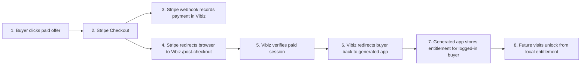

# Generated App Payment Unlock Flow

Minimal one-time purchase flow for a generated Vibiz app.

Notes:

- `/post-checkout` is not called by our frontend. Stripe redirects the buyer's browser there after checkout because Vibiz configures it on the Payment Link.
- The webhook and redirect are separate. The webhook records the payment; the redirect returns the buyer to the generated app.
- Today, `/post-checkout` verifies payment and redirects with a success marker. The proposed next step is to redirect with a short-lived claim so the generated app can safely store local paid access.
