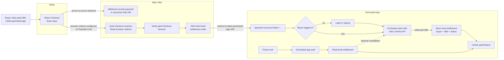

# Generated App Payment Entitlement Flow

This is the simplest one-time purchase flow we want generated Vibiz apps to follow. Main Vibiz remains the payment source of truth. The generated app owns buyer UX, local auth, and local feature access.

## Current Baseline

Today, Vibiz creates Stripe Payment Links for generated app offers. Those links send Stripe webhooks back to Vibiz so payments can be recorded centrally. After checkout, Stripe redirects the buyer browser to the main Vibiz `/post-checkout` route because Vibiz configured that URL on the Payment Link.

The current redirect path verifies the Stripe Checkout Session and sends the buyer back to the latest deployed generated app URL with a success marker. It does not yet mint a short-lived entitlement claim token.

## Proposed Runtime Entitlement Bridge

The next foundation layer is to make `/post-checkout` mint a short-lived entitlement claim after it verifies the paid Stripe Checkout Session. Vibiz then redirects the buyer to the generated app's `/payment-success?claim=...` route. The generated app exchanges that claim with a Vibiz runtime entitlement API, links the entitlement to the app's logged-in buyer, stores a local entitlement row, and unlocks paid features on future visits.

## Who Calls What

`/post-checkout` is not a frontend fetch from Vibiz code. Stripe calls it by redirecting the buyer's browser after checkout because the Payment Link is configured with that URL.

The Stripe webhook and `/post-checkout` serve different jobs. The webhook is server-to-server and records payment in the main Vibiz database. The redirect is browser navigation and returns the buyer to the generated app.

The entitlement claim is the proposed bridge. Its job is to prove to the generated app that Main Vibiz saw and verified a paid checkout for a specific offer, without giving the generated app Stripe secrets or making the generated app own Stripe webhooks.

On first return, the generated app should require a buyer login if needed, exchange the claim with Vibiz, then store a local entitlement. On later visits, the generated app should unlock from its local entitlement table, with optional Vibiz runtime revalidation for stale, revoked, or subscription-like access.
